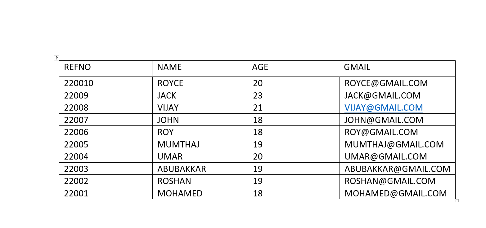
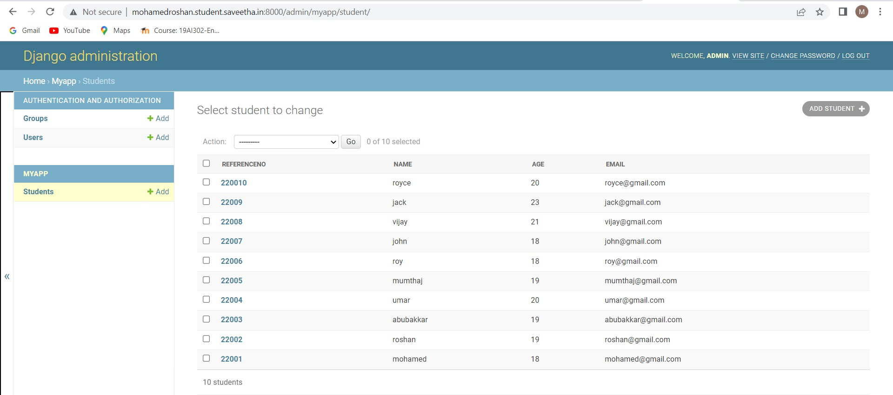
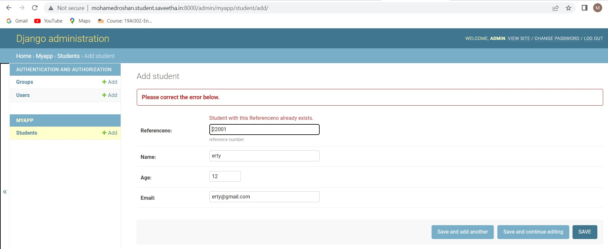
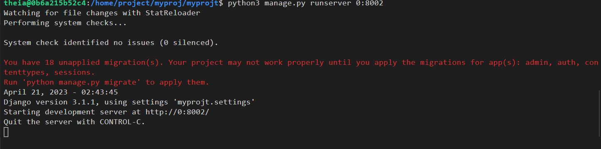

# Django ORM Web Application

## AIM
To develop a Django application to store and retrieve data from a database using Object Relational Mapping(ORM).

## Entity Relationship Diagram



## DESIGN STEPS

### STEP 1:

Clone The Project from github

### STEP 2:

Create a new app

### STEP 3:

Enter the code for admin.py and models.py

### STEP 4:

Execute Django admin and create five student

## PROGRAM

``` python
models.py

from django.db import models
from django.contrib import admin


# Create your models here.
class Student (models.Model):
    referenceno=models.CharField(max_length=20,help_text="reference number")
    name=models.CharField(max_length=100)
    age=models.IntegerField()
    email=models.EmailField()


class StudentAdmin(admin.ModelAdmin):
    list_display=('referenceno','name','age','email')

admin.py

from django.contrib import admin
from .models import Student,StudentAdmin


# Register your models here.
admin.site.register(Student,StudentAdmin)

```

## OUTPUT



## PRIMARY OUTPUT



## SEVER OUTPUT



## RESULT

Program executed Successfully